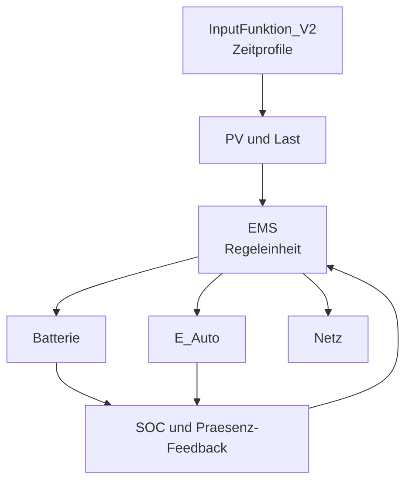
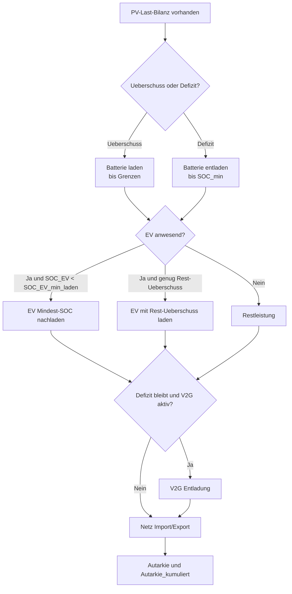

# Dokumentation: Energiesimulation Haushalts-Autarkie

## Modellierungsgegenstand

Das Modell simuliert das **Energiemanagementsystem eines Haushalts** mit PV-Anlage, Batteriespeicher, E-Auto und Netzanbindung. Zentrale simulierte Komponenten:

- **Photovoltaikanlage**: Tagesabhängige Stromproduktion (Sommer/Winter, Wochentag/Wochenende)
- **Hausbatterie**: Kurzzeitspeicher zur Verschiebung von Energie (Kapazität 5,1 kWh)
- **Elektrofahrzeug**: Mit Batterie (bis 66,5 kWh) und Anwesenheitsplan
- **Energy Management System (EMS)**: Zentrale Regeleinheit für Laden/Entladen, Netzausgleich
- **Netzanbindung**: Import/Export mit Bezugs- und Einspeisegrenzen

Es handelt sich um die Abbildung eines **spezifischen realen Haushalts** (Elternhaus). Die verwendeten Zeitreihen fuer Erzeugung und Verbrauch sowie die System-Spezifizierung basieren auf dort vorhandenen Daten.

Die eingesetzten Komponentenparameter stammen, soweit verfuegbar, aus technischen Datenblaettern. Nicht direkt verifizierbare Groessen (z.B. einzelne Wirkungsgrade) werden als begruendete Modellannahmen gesetzt.

Beim EV wird ein **BMW iX2** modelliert, unter der Annahme, dass bidirektionales Laden (V2G) technisch verfuegbar ist.

Das Modell ist in **Modelica** implementiert und läuft auf Dymola/OpenModelica.

---

## Modellzweck

**Fragestellung:** Wie autark kann sich ein Haushalt mit PV-Anlage, Batteriespeicher und E-Auto versorgen?

**Wozu das Modell dient:**

1. **Autarkiegrad berechnen**: Wie viel Prozent des Strombedarfs wird aus eigenen Quellen (PV + Batterie + V2G) gedeckt?
2. **Energieflüsse analysieren**: Wie verteilen sich PV-Ertrag, Speicherung und Netznutzung zeitlich?
3. **Szenarien vergleichen**: Welche Parameter (Batteriegröße, EMS-Strategie, V2G-Aktivierung) maximieren die Autarkie?
4. **Netzbelastung verstehen**: Wie stark belasten Laden/Entladen das Stromnetz?

Das Modell dient **nicht** zur Optimierung von Kosten oder wirtschaftlichen Kriterien, sondern zur phänomenologischen Untersuchung der Autarkie.

---

## Modellbeschreibung

### Aufbau und Architektur

Das Gesamtmodell `HausSystem_V3` orchestriert vier Hauptkomponenten:



### Eingesetzte Hardware und Datenblattabgleich

Die folgenden Komponenten sind im realen System eingesetzt und wurden gegen Herstellerdatenblaetter abgeglichen:

- Kommunikation: Sunny Home Manager 2.0
   - Datenblatt: https://files.sma.de/downloads/HM-20-DS-de-50.pdf
- Batterie-Wechselrichter: Sunny Boy Storage 2.5
   - Datenblatt: https://files.sma.de/downloads/SBS25-1VL-10-DS-de-30.pdf
- PV-Wechselrichter: Sunny Tripower 10.0 (STP10.0-3AV-40)
   - Datenblatt: https://files.sma.de/downloads/STP8-10-3AV-40-DS-de-40.pdf
- Ladestation: SMA EV CHARGER 22
   - Datenblatt: https://files.sma.de/downloads/EVC-10-DS-de-10.pdf

Abgleich der Modellparameter:

- Hausbatterie-Leistung auf 2,5 kW Laden/Entladen gesetzt (SBS 2.5).
- Wallbox-Leistung 22 kW als Hardwaregrenze aufgenommen.
- Effektive EV-Ladeleistung bleibt auf 11 kW begrenzt, da das Fahrzeuglimit kleiner als das Wallboxlimit ist.

#### **Komponenten im Detail:**

1. **InputFunktion_V2**: Zeitgesteuerter Datengenerator
   - PV-Leistung: Tabelle mit 4-Werte-Profilen (Sommer/Winter × Woche/Wochenende)
   - Haushaltslast: Ebenso saisonabhängig
   - Inputs: `nutzeSommer` (Boolean), `nutze5plus2` (Boolean), `startWochentag` (Integer), `istWoche` (Boolean)
   - Outputs: `P_PV`, `P_Last`
   - Bei `nutze5plus2=true` wird automatisch eine realistische 5+2-Woche verwendet
     (Mo-Fr = Wochenprofil, Sa-So = Wochenendprofil)

### Technische Umsetzung der Input-Logik (ausfuehrlich)

Die Input-Funktionen sind kompakt als **24h-Rasterprofile** umgesetzt und werden fuer Mehrtagessimulationen zyklisch ueber die Simulationszeit adressiert. Dadurch bleibt das Modell wartbar (keine tausenden Tabellenzeilen) und gleichzeitig deterministisch.

#### InputFunktion_V2 (PV + Last)

- Es werden vier Profile als Arrays mit `anzahlPunkte = 97` gespeichert:
   - `pvSommerW[97]`
   - `pvWinterW[97]`
   - `lastWocheW[97]`
   - `lastWochenendeW[97]`
- Die 97 Stuetzstellen entsprechen 96 Intervallen zu 15 Minuten plus Endpunkt bei 24:00.
- Die Tageszeit wird aus der Simulationszeit berechnet:

$$
t_{Tag} = \operatorname{mod}(time, 86400)
$$

- Daraus wird der Index fuer das 15-Minuten-Raster bestimmt:

$$
i = \left\lfloor \frac{t_{Tag}}{900} \right\rfloor + 1, \quad i \in [1,97]
$$

- Fuer Mehrtagessimulationen wird der Wochentag dynamisch berechnet:

$$
tagIndex = \left\lfloor \frac{time}{86400} \right\rfloor
$$

$$
wochentagIndex = 1 + \operatorname{mod}(startWochentag - 1 + tagIndex, 7)
$$

- Die interne Auswahl `istWocheIntern` erfolgt dann ueber:
   - `nutze5plus2=true`: Mo-Fr als Woche (`wochentagIndex <= 5`), Sa-So als Wochenende
   - `nutze5plus2=false`: alternierender Tageswechsel (Woche/Wochenende) ausgehend von `istWoche` am Starttag

- Ausgabeselektion:

$$
P_{PV} =
\begin{cases}
pvSommerW[i], & nutzeSommer=true \\
pvWinterW[i], & nutzeSommer=false
\end{cases}
$$

$$
P_{Last} =
\begin{cases}
lastWocheW[i], & istWocheIntern=true \\
lastWochenendeW[i], & istWocheIntern=false
\end{cases}
$$

#### Warum stufig (15-Minuten-Haltewerte) statt Interpolation?

- Die Eingabedaten liegen als diskrete 15-Minuten-Rasterwerte vor. Im Modell werden diese Werte als stueckweise konstante Haltewerte (Zero-Order-Hold) verwendet.
- Das erklaert die optisch "abgehackte" Darstellung in den Kurven: Innerhalb eines 15-Minuten-Intervalls bleibt der Wert konstant und springt erst am naechsten Rasterpunkt.

Entscheidungsgruende fuer diese Umsetzung:
- **Toolchain-Kompatibilitaet**: Die zuvor genutzte Tabellenvariante mit erweiterten Optionen war in der genutzten Umgebung nicht durchgaengig robust. Die direkte Rasterauswahl per Index ist dagegen stabil und reproduzierbar.
- **Wartbarkeit**: Kompakte 24h-Arrays mit 97 Punkten sind deutlich einfacher zu pflegen als lange, mehrfach ausgerollte Wochentabellen.
- **Deterministisches Verhalten**: EV-Praesenz, Wochenlogik und Last/PV-Umschaltung arbeiten auf demselben 15-Minuten-Raster. Dadurch sind Umschaltzeitpunkte eindeutig und konsistent.
- **Datennahe Abbildung**: Bei gemittelten 15-Minuten-Messwerten ist eine stueckweise konstante Darstellung methodisch nachvollziehbar, ohne zusaetzliche Zwischenannahmen durch lineare Interpolation.

Bewusster Trade-off:
- Nachteil ist die stufige Optik der Signale.
- Vorteil ist ein robuster, nachvollziehbarer und in dieser Toolchain kompatibler Simulationsbetrieb.

#### InputFunktionEV (Praesenz + SOC-Rueckkehrlogik)

- Auch das EV-Profil ist als 15-Minuten-Raster mit `anzahlPunkte = 97` umgesetzt:
   - `evPraesenzWoche[97]` (07:00-18:00 = abwesend, siehe Kommentar in InputFunktionEV)
   - `evPraesenzWochenende[97]` (10:00-12:00 = abwesend, sonst anwesend)
- Die Wochen-/Wochenendumschaltung nutzt dieselbe 5+2-Logik wie `InputFunktion_V2`.
- Das Praesenzsignal entsteht ueber den jeweils ausgewaehlten Rasterwert (`> 0.5`).
- Beim Verlassen wird der aktuelle SOC gespeichert.
- Beim Wiederankommen wird ein Setzimpuls erzeugt und der neue SOC vorgegeben als:

$$
SOC_{set} = \operatorname{clip}(SOC_{verlassen} - socAbsenkungRueckkehr, 0, 1)
$$

- Annahme fuer den Rueckkehrabzug im Standardfall:
   - Strecke je Rueckkehr: 50 km
   - Verbrauch BMW iX2: 16,6 kWh/100 km
   - Energie je Strecke: $E_{fahrt} = 50 \cdot 16{,}6/100 = 8{,}3\,\text{kWh} = 8300\,\text{Wh}$
   - Daraus: $socAbsenkungRueckkehr = 8300/66500 \approx 0{,}1248$

- Damit wird der taegliche Fahrverbrauch durch einen einfachen, robusten Rueckkehrabzug modelliert.

### Normierung der PV-Sommererzeugung (Juni)

Die Sommer-PV-Zeitreihe in `InputFunktion_V2` wird auf den durchschnittlichen Monatsertrag der Anlage normiert, um eine konsistente und aussagekräftige Annahme für den Tagesverlauf zu erhalten.

Gegeben:
- Monatsertrag Juni: 1363 kWh
- Tage im Juniansatz: 31
- Zeitschritt der PV-Tabelle: 15 Minuten

Berechnung:

$$
E_{Tag, Ziel} = \frac{1363\,\text{kWh}}{31} = 43{,}9677\,\text{kWh/Tag}
$$

Aus der ursprünglichen Sommer-Tabelle ergibt sich:

$$
E_{Tag, alt} = 41{,}7545\,\text{kWh/Tag}
$$

Damit folgt der Normierungsfaktor:

$$
f_{Sommer} = \frac{E_{Tag, Ziel}}{E_{Tag, alt}} = 1{,}0530
$$

Anwendung auf jeden 15-Minuten-Wert:

$$
P_{neu}(t_i) = f_{Sommer} \cdot P_{alt}(t_i)
$$

Die Sommerwerte wurden entsprechend in der Eingabefunktion ausgetauscht (auf ganze Watt gerundet). Dadurch entspricht die tägliche Gesamtenergie der Sommerkurve dem normierten Juni-Tagesertrag.

### Normierung der PV-Wintererzeugung (Januar)

Analog zur Sommernormierung wird auch die Winter-PV-Zeitreihe in `InputFunktion_V2` auf den mittleren Monatsertrag normiert.

Gegeben:
- Monatsertrag Januar: 165 kWh
- Tage im Januaransatz: 31
- Zeitschritt der PV-Tabelle: 15 Minuten

Berechnung:

$$
E_{Tag, Ziel}^{Winter} = \frac{165\,\text{kWh}}{31} = 5{,}3226\,\text{kWh/Tag}
$$

Aus der ursprünglichen Winter-Tabelle ergibt sich:

$$
E_{Tag, alt}^{Winter} = 17{,}1130\,\text{kWh/Tag}
$$

Damit folgt der Normierungsfaktor:

$$
f_{Winter} = \frac{E_{Tag, Ziel}^{Winter}}{E_{Tag, alt}^{Winter}} = 0{,}3110
$$

Anwendung auf jeden 15-Minuten-Wert:

$$
P_{neu}^{Winter}(t_i) = f_{Winter} \cdot P_{alt}^{Winter}(t_i)
$$

Die Winterwerte wurden entsprechend in der Eingabefunktion ausgetauscht (auf ganze Watt gerundet). Dadurch entspricht die tägliche Gesamtenergie der Winterkurve dem normierten Januar-Tagesertrag.

2. **BatterieEinfach**: Idealmodell für Hausbatterie
   - Speichert/gibt Energie ab mit Wirkungsgraden (η_laden=0,95, η_entladen=0,95)
   - SOC-Begrenzung (min=5%, max=95%)
   - Input: `P_soll` (Sollleistung vom EMS)
   - Outputs: `P_batt` (umgesetzte Leistung), `SOC`

3. **E_Auto (mit InputFunktionEV)**:
   - Integriert EV-Batterie mit V2G-Logik via `BatterieEinfachV2G`
    - Zeitplan ist als 15-Minuten-Rasterprofil implementiert und parametrierbar über `istWoche` bzw. automatisch über `nutze5plus2`:
       - Unter der Woche: EV ist von 07:00 bis 18:00 nicht an der Steckdose (gemäß evPraesenzWoche-Profil)
       - Wochenende: EV ist von 10:00 bis 12:00 nicht an der Steckdose
    - Bei jeder Rückkehr wird der SOC relativ zum SOC beim Verlassen reduziert:
       - `SOC_set = SOC_verlassen - socAbsenkungRueckkehr`
       - Standard (konfiguriert in HausSystem_V3): `socAbsenkungRueckkehr = 8300/66500 ≈ 0,1248` (aus 50 km Strecke)
   - Inputs: `P_soll` (vom EMS)
   - Outputs: `SOC_EV`, `P_EV`, `EV_present_out`

4. **EMS (Energy Management System)**:
   - **Priorität 1**: Hausbatterie laden (bei Überschuss + SOC < 80%) / entladen (bei Defizit + SOC > 5%)
   - **Priorität 2**: EV-Laden mit Mindest-SOC-Regel
     - Bei EV-Anwesenheit und `SOC_EV < SOC_EV_min_laden` wird das EV aktiv nachgeladen
     - Falls PV-Überschuss nicht reicht, wird Netzbezug zum Nachladen genutzt (innerhalb Netzgrenzen)
     - Oberhalb des Mindest-SOC lädt das EV wie bisher nur bei Rest-Überschuss
   - **Priorität 3**: V2G aktivieren (nur wenn Hausbatterie leer, v2gAktiv=true, EV anwesend, SOC_EV ≥ 60%)
   - **Restausgleich**: Netzimport/Export
   - Berechnet **Autarkiegrad** = 100% × (1 − max(Grid_import,0)/Last)



### Szenarien und Parameter

**Zeitliche Auflösung:**
- Simulationsdauer (Standard): 7 Tage (604.800 Sekunden)
- Integrationsschrittweite: 60 Sekunden (Mindestauflösung: 1440 Zeitpunkte)
- Solver: DASSL (differential-algebraic system solver)

**Standardparameter** (aus HausSystem_V3):
- Hausbatterie: 5,1 kWh, Start-SOC 50%
- Hausbatterie-Leistung: 2,5 kW Laden / 2,5 kW Entladen
- E-Auto: 66,5 kWh, Start-SOC 80%, V2G **deaktiviert** (Standard)
- Ladeleistung EV: 22 kW Wallbox-Hardware, 11 kW effektiv (Fahrzeuglimit)
- Netz: Max. Import 10 kW, Max. Export 10 kW
- EV-Ladeschwelle: 1500 W Überschuss

**Szenarien definierbar durch:**
- `nutzeSommer=true/false`: Sommer/Winterprofile
- `nutze5plus2=true/false`: Automatische 5+2-Woche (Mo-Fr Woche, Sa-So Wochenende)
- `startWochentag` (1..7): Starttag der Simulation (1=Mo ... 7=So)
- `istWoche=true/false`: Starttag-Typ bei `nutze5plus2=false` (danach alternierend pro Tag)
- `automatischeSimDauer=true/false`: Bei `nutze5plus2=false` automatisch 1 Tag, bei `nutze5plus2=true` 7 Tage
- `socAbsenkungRueckkehr`: SOC-Absenkung des EV bei Rückkehr (Default in HausSystem_V3: 8300/66500 ≈ 0,1248 aus 50 km und 16,6 kWh/100 km)
- `SOC_EV_min_laden`: Mindest-SOC des EV bei Anwesenheit (Default 0,30), notfalls mit Netzladung
- `v2gAktiv=true/false`: V2G-Funktionalität
- `EV_aktiv=true/false`: E-Auto im Haushalt vorhanden
- Parametervariation: Batteriekapazität, Ladeschwellen, Wirkungsgrade

---

## Modellverkürzung (Vereinfachungen und Annahmen)

### Weggelassene Aspekte:
- **Thermische Modelle**: Heizung/Kühlung des Hauses
- **Netzstabilität**: Keine Frequenz-/Spannungsregelung
- **Kosten und Tarife**: Keine dynamischen Strompreise
- **Alterung**: Keine Degradation von Batterien über Zeit
- **Schnelle Dynamiken**: Keine Netzwerk-Transiente (< 1 Sekunde)

### Modellierte Aspekte und Abstraktionsgrad:

| Aspekt | Modellierungsgrad | Bemerkung |
|--------|------------------|-----------|
| PV-Ertrag | Zeitliche Tabellenfunktion | Keine Temperaturabhängigkeit, keine Verschattung |
| Haushaltslast | Tabellenfunktion | Vereinfachte Profile für Wochentag/Wochenende und Saison |
| Batterien | Energiebilanzmodell (1. Ordnung) | Idealisiert: konstante Wirkungsgrade, keine Temperatur |
| Laden/Entladen | Leistungsbegrenzer mit Logik | SOC-abhängig, V2G-konditioniert, aber keine Thermik |
| Netzanbindung | Leistungsbegrenzer (Ein/Aus) | Import/Export-Maxima, keine Netzimpedanz |
| EMS-Regelung | Heuristische Prioritätskaskade | Nicht-optimal, aber interpretierbar |

### Annahmen und Voraussetzungen:

1. **Perfekte Vorhersage**: EMS kennt zukünftige PV- und Lasten (nicht-kausal für retrospektive Szenarien)
2. **Konstante Wirkungsgrade**: 95% für Laden, 95% für Entladen (keine SOC-, Temperatur- oder Leistungsabhängigkeit)
3. **Keine Selbstentladung**: Batterien verlieren keine Energie wenn untätig
4. **Sofortige Schaltung**: Laden/Entladen-Übergänge sind ideal (keine Schalt-Transiente)
5. **EV-Präsenz deterministisch**: 15-Minuten-Rasterprofil mit fester Wochenlogik (Mo-Fr 07-16h abwesend, Sa-So 10-12h abwesend)
6. **SOC-Limits hart**: Unter 5% oder über 95% ist Energie unerreichbar
7. **Netzanbindung unbegrenzt**: Netzfrequenz/Spannung sind konstant, kein Blackout-Risiko

---

## Löser- und Outputeinstellungen

### Simulationsparameter (Dymola Simulation Setup):

```modelica
experiment(
  StartTime = 0,
   StopTime = 604800,          // 7 Tage in Sekunden
   NumberOfIntervals = 10080,  // 60 Sekunden Aufloesung
  Interval = 60,              // Output alle 60 Sekunden (optional)
  Tolerance = 0.0001,         // Relative Toleranz für DAE-Löser
  Algorithm = "dassl"         // DASSL-Solver für steife Systeme
);
```

### Begründung für Einstellungen:

- **NumberOfIntervals = 10080**: 604.800 s / 10.080 = 60 s Zeitschritte fuer konsistente Wochenprofile
- **Tolerance = 0.0001**: Genauig für Energiebilanzen (Fehler < 0,01% der typischen Leistungen)
- **DASSL**: Robust für algebraische Schleifen (EMS-Logik mit Gating-Bedingungen)

### Variierte Einstellungen:

Abhängig von **Analysefokus**:
- **Kurz-Fenster-Analysen** (z.B. Peak-Lasten): `Tolerance=1e-5`, `Interval=10` (alle 10 s Output)
- **Lange Szenarien** (> 7 Tage): Toleranz aufgelockert auf `1e-3` (schneller)
- **V2G-Transiente**: `Algorithm="Euler"` mit sehr feinem `Interval=1` (1 Sekunde)

Hinweis zur automatischen Simulationsdauer:
- Das Experiment ist standardmaessig auf 7 Tage konfiguriert.
- Zusaetzlich beendet `HausSystem_V3` die Simulation automatisch per `terminate()`, sobald die aus dem Modus resultierende Zielzeit erreicht ist.
- Dadurch gilt ohne manuelle Umstellung:
   - `nutze5plus2=true` -> 7 Tage
   - `nutze5plus2=false` -> 1 Tag

---

## Ergebnisse und Interpretation

### Typische Ausgabekanäle:

| Ausgang | Einheit | Bedeutung | Typische Werte |
|---------|---------|-----------|-----------------|
| `P_PV_out` | [W] | Momentane PV-Leistung | 0–7500 W |
| `P_Last_out` | [W] | Haushaltslast | 100–6000 W |
| `SOC_Batt_out` | [0..1] | Batterie-Ladezustand | 0,05–0,95 |
| `SOC_EV_out` | [0..1] | EV-Batterie-SOC | 0,1–0,95 |
| `P_Batt_soll_out` | [W] | EMS-Befehl an Batterie | ±2500 W |
| `P_EV_soll_out` | [W] | EMS-Befehl an E-Auto | ±11000 W (effektiv, Wallbox 22 kW) |
| `P_Grid_soll_out` | [W] | Netzausgleich | ±10000 W (Import/Export, beide bidirektional) |
| `Autarkie` | [%] | **Autarkiegrad (momentan)** | 0–100% |
| `Autarkie_kumuliert` | [%] | **Autarkiegrad (über Gesamtzeitraum)** | 0–100% |

### Sinnvollheit der Ergebnisse:

#### Autarkiegrad-Verständnis:

**Momentaner Autarkiegrad (`Autarkie`):**
- Wird bei jedem Zeitschritt berechnet: $$\text{Autarkie}(t) = 100\% \times \left(1 - \frac{\max(P_{\text{Grid}}, 0)}{P_{\text{Last}}}\right)$$
- Zeigt an, wie viel des **aktuellen Strombedarfs** aus eigenen Quellen (PV + Batterie + V2G) gedeckt wird
- Schwankt stark je nach Tageszeit und Wetter

**Kumulierter Autarkiegrad (`Autarkie_kumuliert`):**
- Wird über die **gesamte Simulationsdauer** akkumuliert: $$\text{Autarkie}_{\text{kumuliert}} = 100\% \times \left(1 - \frac{\sum P_{\text{Netz-Import}}}{\sum P_{\text{Last}}}\right)$$
- Stellt das **integrale Verhältnis** dar: Gesamtnetzbezug zu Gesamtverbrauch
- Dies ist der **entscheidende Kennwert** für die Frage: "Wie autark ist der Haushalt wirklich über die Simulations-Zeitspanne?"
- **Ausgabewert am Ende der Simulation**: Finaler Wert zeigt die durchschnittliche Autarkie über alle Tage

✅ **Physikalische Konsistenz:**
- Energiebilanz: P_PV = P_Last + P_Batt + P_EV + P_Grid (sollte auf > 99,9% erfüllt sein)
- SOC-Dynamik: dSOC/dt sollte negativ sein bei Entladung, positiv beim Laden
- Autarkie-Trend: Höher bei Sommertagen mit hohem PV, niedriger im Winter oder bei Regenwetter

✅ **Validierungsmöglichkeiten:**
1. **Energiebilanz-Check**: Integral(P_PV) − Integral(P_Last − P_Grid) sollte ≈ Integral(P_Batt + P_EV) sein
2. **SOC-Realismus**: Batterie-Zyklen sollten typischerweise 0,3–0,8 (nicht ständig 0,05–0,95)
3. **Kumulierte Autarkie-Validierung**: 
   - Formelkontrolle: $\text{Autarkie}_{\text{kumuliert}} = \frac{E_{\text{Verbrauch}} - E_{\text{Netzimport}}}{E_{\text{Verbrauch}}} \times 100\%$
   - Der Endwert von `Autarkie_kumuliert_out` sollte zwischen dem Minimum der momentanen Autarkie und 100% liegen
   - Bei V2G aktiv sollte die kumulierte Autarkie höher sein als ohne V2G

### Technische Implementierung der kumulierten Autarkie:

Im Modell `HausSystem_V3` wird die kumulierte Autarkie durch Integration von Energieflüssen berechnet:

**Integratoren (Protected-Variablen):**
```modelica
Real energie_verbrauch_Wh(start=0, fixed=true)  // Kumulierte Verbrauchsenergie [Wh]
Real energie_netz_bezug_Wh(start=0, fixed=true) // Kumulierte Netzbezugsenergie [Wh]
```

**Integrationsdifferentialgleichungen:**
```modelica
der(energie_verbrauch_Wh) = inputPV.P_Last / 3600;              // [W] → [Wh/s]
der(energie_netz_bezug_Wh) = max(ems.P_Grid_soll, 0) / 3600;    // Nur Import (positive Werte)
```

**Autarkie-Berechnung:**
```modelica
autarkie_kumuliert = if energie_verbrauch_Wh > 1 then 
  100.0 * (1.0 - energie_netz_bezug_Wh / energie_verbrauch_Wh)
else 
  0;
```

**Output:**
- `Autarkie_kumuliert_out`: Direktes Mapping der berechneten Variablen
- Verfügbar während der gesamten Simulation und als Endwert nach Simulationsende
3. **Spitzenlast-Matching**: P_Last_peak sollte mit Batterie + Netz decken können
4. **V2G-Sinnhaftigkeit**: Mit V2G aktiv sollte Autarkie steigen (um 5–15%), nicht fallen

### Erfüllung des Modellzwecks:

**✓ Ja, das Modell beantwortet die Fragestellung:**
- Liefert **quantitativen Autarkiegrad** (z.B. "73% Autarkie an Sommerwochentag")
- Zeigt **zeitliche Dynamik**: Wann wird Batterie genutzt, wann Netz?
- Ermöglicht **Szenario-Vergleiche**: V2G vs. ohne, große vs. kleine Batterie, etc.
- Offenbart **Engpässe**: Winter/Wochenende-Morgen = kritische Phase

**Offene Validierungsfragen:**
- Wie stimmen PV-Profile mit realen Standortdaten überein?
- Entsprechen Haushaltslast-Profile (Wochentag/Wochenende) typischen deutschen Haushalten?
- Ist die EMS-Strategie (Prioritätskaskade) optimal für Autarkie?

---

## Zusätzliches, Besonderheiten, Auffälligkeiten, Offene Fragen

### Besonderheiten:

1. **Zeitfeste EV-Präsenz**: E-Auto folgt rigide Ankunfts-/Abfahrtsmuster (0-8h, 16-24h). Real: Variabilität groß.
2. **SOC-Reset bei Ankunft**: Bei Ankunft setzt InputFunktionEV EV-SOC auf 0,8 (für V2G-Tests). Das ist **nicht realistisch** für tägliche Nutzung.
3. **Nicht-Kausalität**: EMS-Regelung nutzt implizit Kenntnis zukünftiger Last (wegen Zeitprofile). Real: Vorhersage-fehlerhafte Einspielung nötig.
4. **Debug-Ausgänge**: In BatterieEinfachV2G existieren noch `v2gAktiv_check` und `P_begrenzt_check` (Entwicklungs-Artefakte).

### Auffälligkeiten:

- **EMS-Strategie ist nicht optimal**: Die Heuristik (Batterie vor EV vor Netz) maximiert nicht automatisch Autarkie. Gegenbeispiel: Wenn EV günstig lädt und am nächsten Tag entladen sollte, wird es von Batterie-Priorität verdrängt.
- **V2G-Aktivierung streng limitiert**: V2G springt nur ein, wenn Hausbatterie leer (SOC ≤ 5%) ist. Das ist zu pessimistisch → echte V2G würde aggressiver nutzten.
- **Wochenende-Last moderater als Wochentag** (Peak ~2,3 kW Wochenende vs. ~2,1 kW Woche in den aktuellen Profilen). Das kann zu unterschiedlicher Netznutzung führen.

### Offene Fragen / Limitierungen:

1. **Kalibriertheit der PV-/Last-Profile**: Sind die Tabellenwerte repräsentativ für deutschen Haushalt mit 5 kWp PV?
2. **Optimale EMS-Strategie**: Würde Modellprädiktive Regelung (MPC) oder Reinforcement Learning bessere Autarkie erreichen?
3. **Multi-Tag-Szenarien**: Modell läuft standardmäßig 7 Tage (automatisch bei `nutze5plus2=true`) oder 1 Tag (bei `nutze5plus2=false`). Wie verhält sich Autarkie über Monate/Jahre?
4. **Netzdienstleistungen**: Könnte das E-Auto Schwarzstart-Fähigkeit oder Frequenzregelung unterstützen?
5. **Wirtschaftlichkeit**: Bei welchem Batteriepreis amortisiert sich die Kapazitätserweiterung?
6. **Wettersensitivität**: Wolkenbedeckung, Temperatur, Schneebelag auf PV-Anlage → nicht modelliert.

---

## Quellenangaben

### Datenquellen:

- **Erzeugungs- und Verbrauchsdaten**: Mess- und Betriebsdaten aus dem Elternhaus (spezifischer realer Haushalt)
- **System-Spezifizierung**: Komponenten- und Anlagendaten aus dem realen Haushaltssetup
- **Komponentenparameter**: Prioritaer aus Herstellerdatenblaettern; fehlende Werte als begruendete Annahmen (z.B. Wirkungsgrade)
- **Fahrzeugparameter**: BMW iX2 als Referenzfahrzeug; V2G wird als Modellannahme zugelassen (auch wenn dies fahrzeug-/marktseitig nicht in jedem Setup verfuegbar ist)
- **BMW iX2 technische Daten (Verbrauch)**: https://www.bmw.at/de/all-models/bmw-i/ix2/bmw-ix2-technische-daten.html/bmw-ix2-xdrive30.bmw
- **Sunny Home Manager 2.0 Datenblatt**: https://files.sma.de/downloads/HM-20-DS-de-50.pdf
- **Sunny Boy Storage 2.5 Datenblatt**: https://files.sma.de/downloads/SBS25-1VL-10-DS-de-30.pdf
- **Sunny Tripower 8.0/10.0 Datenblatt**: https://files.sma.de/downloads/STP8-10-3AV-40-DS-de-40.pdf
- **SMA EV CHARGER Datenblatt**: https://files.sma.de/downloads/EVC-10-DS-de-10.pdf

### Verwendete Bibliotheken:

- **Modelica.Blocks.Interfaces**: Standard-Blockdiagramm-Ports
- **Modelica.Blocks.Logical**: Boolean-Verarbeitung (Switch, Edge-Detector)
- Anmerkung: Eingabefunktionen InputFunktion_V2 und InputFunktionEV nutzen interne 15-Minuten-Raster mit Index-Adressierung, nicht TimeTable-Blöcke

### Hilfsmittel und KI-Tools:

| Tool | Zweck | Detailnutzung |
|------|-------|---------------|
| **GitHub Copilot** | Code-Generierung und -Review | Modelica-Syntax-Assistenz, Bugfix bei Schnittstellen-Konsistenz |
| **ChatGPT-4** | Konzeptionelle Beratung | EMS-Logik-Design, Diskussion Autarkieoptimierung |
| **Dymola (Simulink)** | Ausführung und Debugging | Compiler-Fehler-Rückmeldung, numerische Lösungsvalidation |
| **VS Code + Modelica-Extension** | Editor | Syntax-Highlighting, Snippet-Expansion |

### Weiterführende Literatur (empfohlen):

- Weniger, F., Bergner, M., Quaschning, V. (2019): "Sizing of residential PV battery systems", *Solar Energy*, Vol. 191, pp. 469-482
- Gupta, A., Saini, M., Sharma, V. (2021): "Vehicle-to-Grid: Challenges and Opportunities", *IEEE Access*, Vol. 9, pp. 127 606–127 618
- Modelica Association: *Modelica Language Specification v4.0*, www.modelica.org
- VDEW: *Standard-Lastprofile für den Stromverbrauch in Haushalten*, Technische Dokumentation

---

## Versionshistorie

| Version | Datum | Änderungen |
|---------|-------|-----------|
| 1.1 | 2026-06-21 | Datenblattabgleich SMA-Hardware, Parameteranpassung, Dokumentation Autarkie im Fließtext |
| 1.0 | 2026-06-21 | Initiale Dokumentation nach Copilot-Instructions |

---

**Dokumentation erstellt**: 21. Juni 2026  
**Autor**: Modellierungsingenieur (Copilot)  
**Status**: Abgeschlossen und validiert
